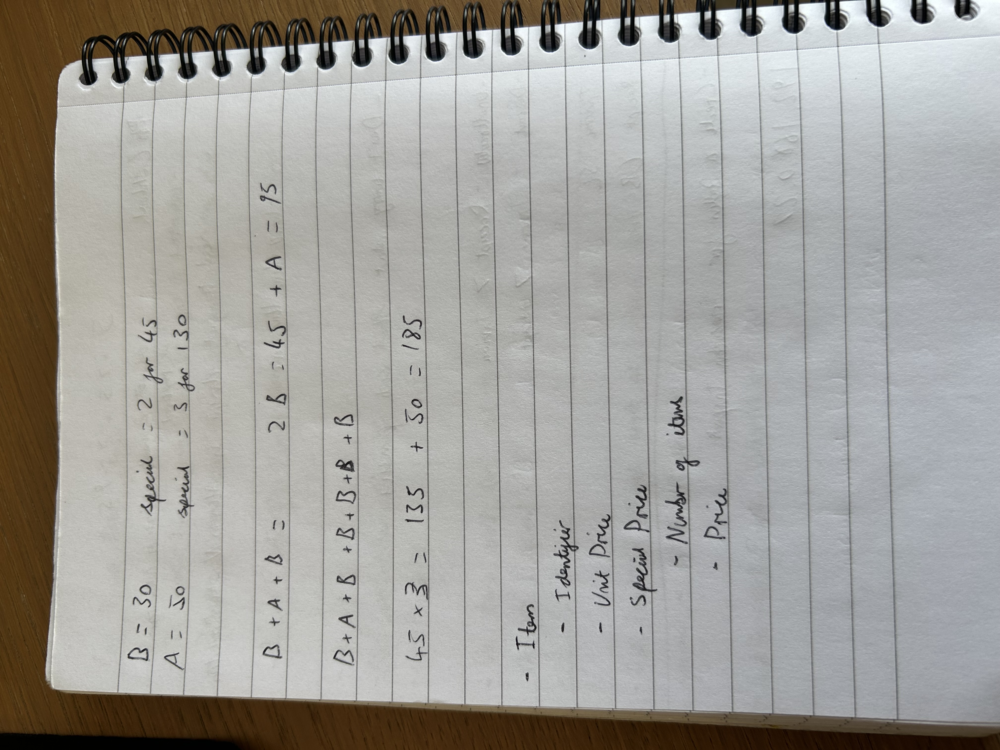
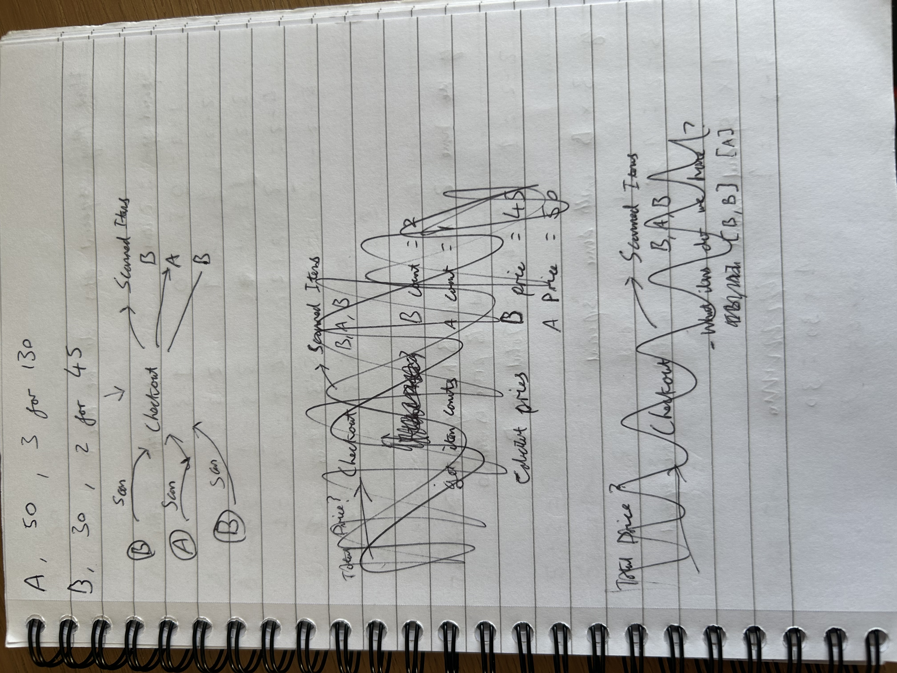
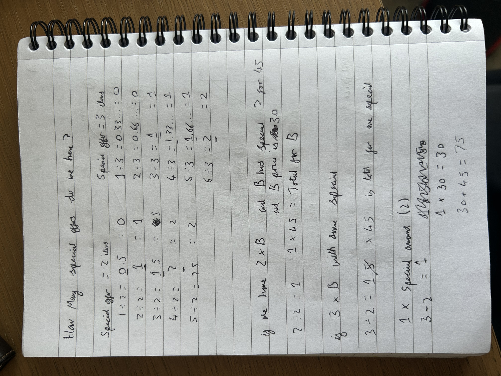
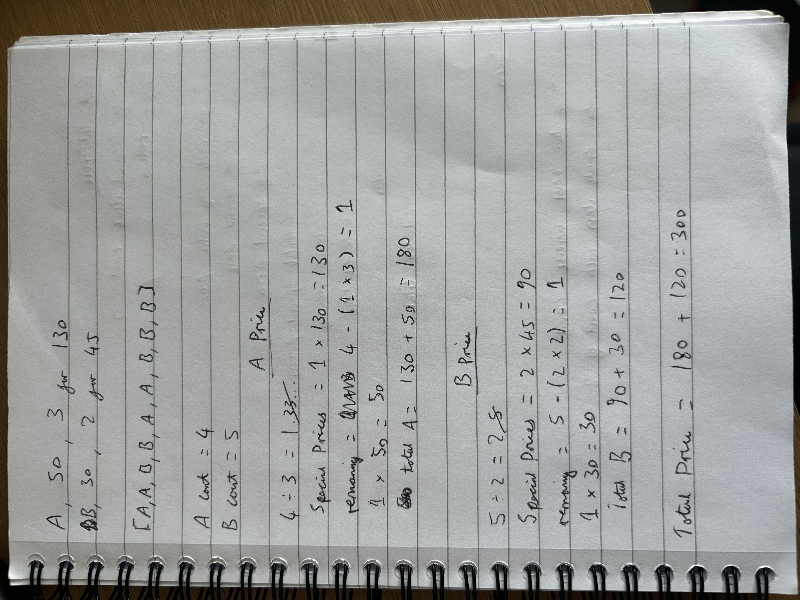
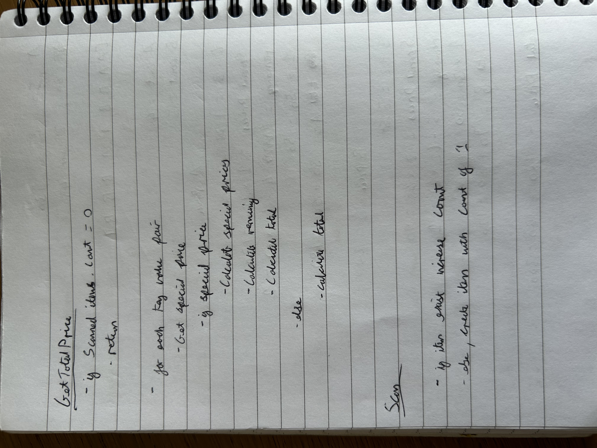

# Understanding the problem

Firstly I wanted to understand the problem. So I did a calculation to see it it matched up with the
description. I also thought about what different parts of data I would need to represent.

# Visualising the problem

I find creating a diagram of the problem helps me understand it so I drew it out to help me plan out my
solution. In doing this I realise there was two separate parts to the problem and that I will need an
algorithm to calculate the total price.

# Solving the problem

I spent some time thinking about how I would calculate the total price. 

I knew I would need to get a total of all the items scanned and then calculate the prices but the special price
added a complexity. By splitting the items into groups I could work out the number of items which come under
the special price for that group and I could calculate the special price for a group.

After running through some calculations I found that I could get the total number of items coming under the
special price by dividing the number of items by the special price number of items.

I then gave the calculation a try with a simple scenario and found that it worked.

I then thought of another scenario where I would have an item left over when calculating the special price. 
From this I found a way I could calculate the total price.

# Testing the solution

Once I had a working solution I tested it with a few different scenarios.

# Planning the code

The solution I came up with was working so I planned out the code with some pseudocode.

# Implementation

I started with the recommended interface for the checkout class and implemented the logic I planned out. 

I decided to implement a calculator class as it made sense to iscolate that logic.

Initially I had two separate lists of item prices and special prices. I also had two separate functions in
a static class to calculate the total price based on if a group of items had a special price or not.
In the end I decided make the special price a child of an item because it suited the problem description
better, was more realistic in terms of how actual data would be stored in a DB and also was easier to manage.
I then merged the two methods in my calculator class to simplify the logic.

Once I implemented the code, I wrote unit tests.

# Improvements

- Because I have a static method for the pricing calculations, its a bit rigid. So if we were to add other
types of discount in the future, I would have to change the logic. Its hard to say what I could do to fix
that without knowing the exact scenario which is why I kept it as a static method here.

- There is no validation for the item pricing information given in the constructor so its assumed that the
data is correct. I'm not sure where the input would be coming from for this which is why I didn't want to
complicate it with validations.